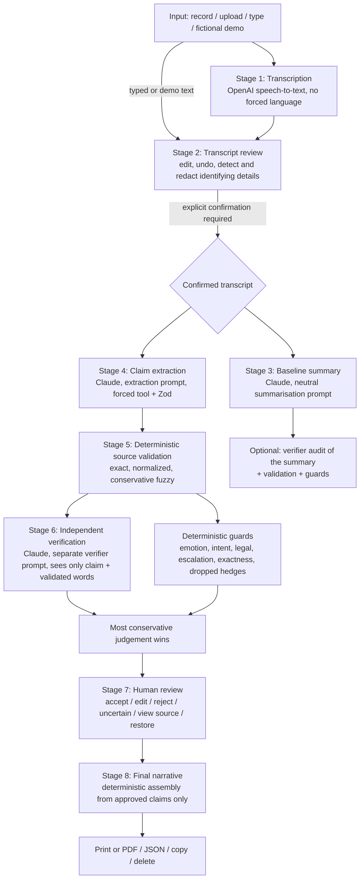

# Bol

**An evidence-preserving AI interface for sensitive narratives**

*Organize the story without taking ownership of it.*

Bol is an HCI research prototype. It investigates how evidence-linked, uncertainty-aware AI can help people structure sensitive, incomplete or multilingual narratives without speaking on their behalf. It is not a harassment-reporting application, and it is not ready for real-world high-stakes use.

The first demonstration uses a fictional account informed by psychology research on stranger harassment. The interaction model is domain-neutral and is also demonstrated on a UX research interview. It is intended to transfer to workplace incident notes, university complaints, NGO interviews, civic complaints and sensitive diary studies.

## Contents

1. [Human problem](#human-problem)
2. [Research question](#research-question)
3. [The AI's role](#the-ais-role)
4. [Architecture](#architecture)
5. [Data flow](#data-flow)
6. [Responsible-AI safeguards](#responsible-ai-safeguards)
7. [Installation and running](#installation-and-running)
8. [Tests and checks](#tests-and-checks)
9. [Demo mode](#demo-mode)
10. [Five-minute presentation script](#five-minute-presentation-script)
11. [Research mode](#research-mode)
12. [Known limitations](#known-limitations)
13. [Ethical limitations](#ethical-limitations)
14. [Future research plan](#future-research-plan)

## Human problem

People rarely tell sensitive experiences in tidy, chronological, formal language. They remember in fragments, are unsure about times and order, switch between English, Urdu and Roman Urdu, use approximate expressions ("around 6 baje", "kuch der", "Maghrib se pehle"), and worry about being misread.

Conventional forms demand definite answers. Conventional AI summarisers produce structure, but in doing so they can remove uncertainty, add interpretations, infer feelings or intentions, make approximate details sound exact, and detach conclusions from the original words. Because the output is fluent, people may trust it without checking.

Bol aims to reduce two costs at once: the effort of structuring a narrative, and the effort of verifying how the AI interpreted it.

## Research question

> How does evidence-linked AI summarization affect user trust, correction behaviour and perceived control when people review sensitive multilingual narratives?

The prototype explores trust calibration (appropriate trust rather than maximum trust), explainability through source evidence, preservation of uncertainty, user correction, meaningful human control, mixed-initiative interaction, multilingual and culturally situated interaction, and responsible use of generative AI in sensitive contexts.

The central interaction compares two treatments of the same confirmed transcript:

- **Conventional AI Summary.** A normal, neutral summary from an honest summarisation prompt. It is editable but does not show where statements came from. Bol's verifier can be run on it afterwards.
- **Bol Evidence Map.** Atomic claims, each linked to the exact words it came from, labelled direct, approximate, unsupported or cannot determine, with uncertainty markers kept. The person accepts, edits, rejects or marks each claim as uncertain, and only approved claims enter the final narrative.

The aim is to show that polished output is not automatically faithful output. It is not to show that Bol is automatically correct; the interface says so.

## The AI's role

The AI is a bounded assistant inside a pipeline it does not control:

- It **proposes** structure (claims, categories, citations). It never decides what is kept.
- It **checks** claims against cited words, as an independent second opinion that can be overruled by deterministic checks and by the person.
- It **never** judges truth or credibility, classifies events legally, infers intent or emotion, diagnoses, completes missing details, or writes the final narrative.

## Architecture



### Project structure

```
src/
  app/
    page.tsx                   Single-page step flow
    api/status/route.ts        Which services are configured (never key values)
    api/transcribe/route.ts    Stage 1 (OpenAI)
    api/summarize/route.ts     Stage 3 (Claude, baseline)
    api/analyze/route.ts       Stages 4 to 6 (extraction, validation, verification)
    api/audit-summary/route.ts Verifier applied to the baseline summary
  lib/
    schema.ts                  Zod schemas and shared types
    sourceValidation.ts        Stage 5: deterministic source validation
    guards.ts                  Deterministic responsible-AI checks
    pipeline.ts                Pure assembly used by live routes AND fixtures
    narrative.ts               Stage 8: deterministic narrative builder
    session.ts                 In-memory session reducer (no storage)
    metrics.ts                 Evaluation counts and de-identified research export
    redaction.ts               Identifying-detail detection and redaction
    fixtures.ts                Fictional scenarios and precomputed outputs
    clientApi.ts               Client calls, fixture mode, simulated failure
    server/prompts.ts          Separate system prompts per stage
    server/stages.ts           Tool schemas and model calls
    server/clients.ts          SDK clients, safe errors, configuration
  components/                  Screens, claim cards, evidence transcript, demo controls
tests/                         Vitest suites
```

### Key design decisions

- **Structured output by forced tool use.** Each Claude call defines one tool and forces it with `tool_choice`. The tool input is validated with Zod. Malformed output gets one retry, then a safe, retryable error. Raw model output and internal errors are never shown.
- **The verifier is independent in role, not in kind.** It uses a different system prompt and receives only each claim plus the words that passed deterministic validation. It never sees the extraction prompt. It is still an LLM checking an LLM (see limitations).
- **An invented citation cannot lend support.** If a cited excerpt is not found in the transcript, the verifier receives empty cited words and the claim is marked unsupported.
- **Most conservative judgement wins.** The final label is the most cautious of: the extractor's label, the verifier's verdict, the validation result and the guard flags. A missing verdict becomes "cannot determine", never support.
- **The final narrative is not generated by a model.** It is assembled from approved claims in the person's approved wording, so no new content, emotion or certainty can enter at the last step. This is a deliberate interpretation of Stage 8.
- **Unsupported claims never enter silently.** They start excluded. Keeping one requires an explicit "Keep anyway" step, and it then appears in a separate "Kept without verified support" section.

## Data flow

1. Text exists only in React state in the browser tab. Nothing is written to localStorage, cookies, a database or analytics.
2. Audio is held in memory until it is transcribed or deleted. On the server it exists only for the duration of the request and is never written to disk or logged.
3. Only after the person confirms the transcript is it sent to the server, which forwards it to Claude. API keys stay server-side.
4. Server logs contain only a stage name and an error code, for example `[bol] analysis failed: timeout`.
5. Responses carry `Cache-Control: no-store`.
6. Delete session clears the transcript, outputs, decisions and research measures. Closing the tab has the same effect.

Note that the third-party APIs (Anthropic, OpenAI) process the text and audio under their own data policies. Bol does not control that, and the introduction screen says text is sent to AI services.

## Responsible-AI safeguards

**Prompt rules** (`src/lib/server/prompts.ts`). Extraction and verification have separate prompts. Both forbid: embellishment, truth or credibility judgements, crime classification, intent inference, diagnosis, emotion inference unless stated, gender assumptions unless stated (grammatical gender in Urdu counts as stated), completing missing dates, times or places, and making approximate information exact. "I don't know" and "yaad nahi" are treated as valid information. The account is wrapped as data, and instructions inside it are ignored. Culturally specific wording such as Maghrib, kal and baje is kept rather than translated away.

**Deterministic source validation** (`sourceValidation.ts`). Matching is tried in order: exact, then after normalising case, punctuation, curly quotes and Urdu punctuation, then conservative token-window fuzzy matching (threshold 0.88, minimum three tokens). The matched range always comes from the original transcript, which is never modified. Works with Urdu script.

**Deterministic guards** (`guards.ts`). A claim is flagged and downgraded to unsupported when it contains, and its cited words do not:

- emotion terms (English and Roman Urdu, for example terrified, panic, ghabra, pareshan)
- intent terms (intended, deliberately, wanted to)
- legal or evidential terms (harassment, offence, victim, evidence)
- escalation terms (attacked, followed, escaped)
- exact clock times, numbers or words like "exactly"
- a hedged number with the hedge dropped ("around 6" restated as "6")

These checks are intentionally blunt. They catch common drift. They do not understand meaning.

**Language and labels.** The interface uses "person", "participant" or "user", never "victim" or "survivor" as default labels. Optional questions from the model are filtered for emotional, legal or blaming wording, capped at two, and shown as optional. The output is labelled "User-reviewed AI-assisted narrative" and states that it is not an official report, police complaint, verified statement or legal document.

**Out of scope by design.** No authority contact, location tracking, legal advice, diagnosis, emergency assessment, accounts, database, sharing, credibility scoring, truth detection, emotion recognition or facial analysis.

## Installation and running

Requires Node.js 20 or later (developed on Node 22).

```bash
npm install
cp .env.example .env.local   # then add keys
npm run dev                  # http://localhost:3000
```

Production:

```bash
npm run build
npm start
```

### Environment variables

| Variable | Purpose | Default |
| --- | --- | --- |
| `ANTHROPIC_API_KEY` | Summary, extraction and verification | none |
| `ANTHROPIC_SUMMARY_MODEL` | Baseline summary model | `claude-sonnet-5-5` |
| `ANTHROPIC_EXTRACTION_MODEL` | Extraction model | `claude-sonnet-5-5` |
| `ANTHROPIC_VERIFIER_MODEL` | Verifier model | `claude-sonnet-5-5` |
| `OPENAI_API_KEY` | Speech-to-text only | none |
| `OPENAI_TRANSCRIPTION_MODEL` | Transcription model | `gpt-4o-transcribe` |
| `BOL_REQUEST_TIMEOUT_MS` | Per-call timeout | `45000` |

Without keys, the app runs fully on precomputed demonstration output. Typed input still works for review, but live analysis needs `ANTHROPIC_API_KEY`. Recording and upload need `OPENAI_API_KEY`. Confirm the model names are available on your API account before a live demo.

## Tests and checks

```bash
npm test            # Vitest, 43 tests
npm run typecheck   # tsc --noEmit, strict mode
npm run lint        # ESLint (next core-web-vitals + typescript)
npm run build       # production build
npm run check       # all four, in order
```

The tests cover Zod schema validation, exact, normalised, fuzzy and Urdu-script source matching, rejection of invented excerpts, approximate time preservation (including "around 6" never becoming "6:00 PM"), unsupported emotion inference (including "I moved away" never becoming "I was terrified and escaped"), intent and legal inference, conservative merging, user rejection, final narratives containing only approved claims, session deletion, fixture loading, research exports containing no narrative text, and identifying-detail redaction.

## Demo mode

Open **Demo** at the bottom right. Demo controls let you:

- choose a fictional scenario (bus stop account or checkout interview)
- load it for review, or load it as an already-confirmed transcript
- switch between live APIs and precomputed fixtures (live is only offered when the server has a key)
- simulate an API failure (no request is sent; the error and retry path are shown)
- show or hide technical details (claim-level extractor and verifier labels, character ranges, evaluation panel)
- reset the complete experience

**About the fixtures.** Precomputed outputs were written by the project author to make the demo reliable. They are not captured model responses, and the interface labels them "Precomputed demonstration output" wherever they appear. The baseline fixture summaries were written to represent a typical honest summary, not a deliberately bad one. Scenario A's extraction deliberately includes one over-reaching claim ("The person was waiting for a bus") so the demo can show the verifier and guards blocking it. Source validation and the guards run for real on fixtures in the browser, so the validation and guard counts on screen are genuine measurements of those checks. To see what the models actually do, use live mode.

**Resilience.** If the microphone is refused, Bol offers typing, upload or the demo. If transcription is slow, it times out after 90 seconds with alternatives. If a live call fails on a demo transcript, the error offers "Use precomputed demonstration output". Precomputed output only applies to the unedited demo transcripts; edited text needs live mode, and the transcript screen says so.

## Five-minute presentation script

Setup before presenting: open the app, open Demo, choose **Bus stop account**, choose live or precomputed, tick **Show technical details** if you want the evaluation panel, then close Demo and go back to the start.

| Time | Do | Say |
| --- | --- | --- |
| 0:00 to 0:30 | Show the introduction. Point to the research question. | "People don't tell sensitive experiences in tidy, exact language. AI summarisers make them tidy, and sometimes that means making them say things they didn't. Bol asks how linking every AI statement to the person's own words changes trust, correction and control." |
| 0:30 to 1:00 | Tick the checkbox, Continue, Load a fictional demonstration, Load bus stop account. | "This is fictional, in mixed Roman Urdu and English. Notice 'around 6 baje', 'kuch der', 'Maghrib se pehle', and 'exact time yaad nahi'." **(1. Load narrative)** |
| 1:00 to 1:20 | On the transcript screen, show Detect possible identifying details, tick the confirmation, Confirm transcript. | "Nothing is analysed until the person confirms this text. They can edit, redact or delete first." **(2. Confirmed transcript)** |
| 1:20 to 1:50 | Generate conventional summary. | "This is an honest, neutral summary. It reads well. But where did 'waiting', 'staring' and '6 PM' come from? You can't tell from here." **(3. Conventional summary)** |
| 1:50 to 2:20 | Generate Bol evidence map. Gesture between the panels. | "Same transcript. Bol breaks it into single claims, each tied to the exact words underlined in the transcript: solid for direct, wavy for approximate, dashed for unsupported." **(4, 5. Evidence map; opacity versus inspectability)** |
| 2:20 to 2:50 | On Claim 1, View exact source. The span lights up. | "'Kal around 6 baje': found word for word. The claim keeps 'around'. It does not say 6:00 PM." **(6. Exact source, 7. Preserved uncertainty)** |
| 2:50 to 3:20 | Scroll to **What Bol did not assume**. | "No emotional state was inferred. The man's intention was not inferred. 'Around 6' was not converted to a clock time. No legal label was applied. The person can add those things; the AI does not." **(8. Refused inference)** |
| 3:20 to 3:50 | Show Claim 3 (Unsupported). Click Accept to show the Keep anyway warning, then Cancel. Reject Claim 8 or edit Claim 7. | "The extractor over-reached: 'waiting for a bus'. The independent verifier caught it, and it stays out unless the person deliberately keeps it. Here I reject one claim and edit another into my own words." **(9. Edit or reject)** |
| 3:50 to 4:10 | Back on the summary panel, Check this summary with Bol's verifier. | "The same checks on the conventional summary flag '6 PM' as more specific than the source." |
| 4:10 to 4:40 | Accept the remaining claims, Build my narrative. | "The narrative is assembled only from what was approved, in the approved wording, sorted into confirmed, approximate, still uncertain and excluded. No model writes this step." **(10. User-reviewed narrative)** |
| 4:40 to 5:00 | Point to the label and Delete session. | "It's labelled a user-reviewed AI-assisted narrative, not a report or statement. Bol doesn't verify what happened. Evidence linking lowers risk; it doesn't remove it. That's what the user studies are for." |

If anything fails live, open Demo, switch to precomputed fixtures, and continue. The output will be labelled.

## Research mode

Enable **Use research mode** on the introduction screen. It includes an informed-consent section, an optional participant code (never a name) and a facilitator-set condition:

- **Baseline summary interface:** the participant sees and edits only the conventional summary.
- **Bol interface:** the participant sees only the evidence map.

Each participant sees one condition. Measures are kept in browser memory only:

- review time, from first reaching the review screen to building the narrative
- counts of accepted, edited, rejected, uncertain and unreviewed claims
- how many times source evidence was opened
- how many claims were flagged unsupported, and how many of those were rejected or left out
- baseline summary edits
- five 1 to 7 ratings: perceived control, appropriate trust, ease of verification, confidence in the final output, mental effort

**Export de-identified metrics** downloads JSON with counts, timings and ratings only. A test asserts that the export contains no narrative text. These ratings are prototype items, not a validated psychological instrument. No research findings exist yet, and none are claimed.

## Known limitations

- **The prototype does not verify narratives.** It checks whether AI output is supported by the person's words, not whether anything happened.
- **Evidence linking reduces risk but does not guarantee accuracy.** A claim can be correctly cited and still mislead through selection, ordering or omission.
- **LLM self-verification has limitations.** The verifier is a separately prompted model, not an independent mind. It can share the extractor's blind spots, and both can be wrong in the same direction.
- **The deterministic guards are lexical.** They miss paraphrased emotion or intent ("he clearly wanted…" phrased another way) and can flag harmless wording. Lexicons are incomplete, especially for Urdu script.
- **Fuzzy matching is a trade-off.** The 0.88 threshold tolerates small transcription differences but could accept a near-identical excerpt that changes meaning, such as a dropped negation in a long span.
- **Speech transcription can introduce errors**, especially with code-switching, accents and background noise. Errors in the transcript propagate into everything after it, which is why confirmation comes first.
- **Code-switching performance must be evaluated with users.** English, Urdu and Roman Urdu handling has only been tested on the two fictional scenarios.
- **The fixture summaries and extraction were authored**, not recorded from models. Live behaviour will differ.
- **Identifying-detail detection is pattern-based** and will miss names, places and indirect identifiers.
- **Sentence splitting for the summary audit is heuristic.**
- **No live API calls were made during development**, as no keys were available in the build environment. The live path is type-checked and its failure handling was exercised, but extraction and verification quality with real models is untested.

## Ethical limitations

- **The system requires human review.** Every claim starts unreviewed, and unreviewed claims are excluded.
- **Not ready for real-world high-stakes deployment.** It must not be used for legal, institutional, medical or safeguarding decisions.
- **Sharing with AI providers is itself a disclosure.** Real use with sensitive accounts would need data-processing agreements, retention controls and possibly local models.
- **Structure can carry pressure.** Even optional prompts and claim lists can make a person feel their account is incomplete. This needs study with care, not assumption.
- **Neutral is not culture-free.** What counts as neutral wording, and which interpretations are "assumed", is culturally situated.
- **Real accounts need trauma-informed research design.** Studies should use fictional or self-selected low-stakes material first, with ethics approval, support resources and an easy exit.
- **Approved is not true.** A user-reviewed narrative reflects what the person approved at a moment in time, not established fact.

## Future research plan

1. **Pilot (fictional material).** A within-subjects comparison of the baseline and Bol interfaces with fictional accounts. Measure detection of planted unsupported statements, correction behaviour, review time and the prototype ratings. Use think-aloud to see how people interpret evidence labels.
2. **Instrument work.** Replace prototype ratings with validated measures where they exist (for example trust-in-automation scales and NASA-TLX for workload), and pre-register hypotheses.
3. **Multilingual evaluation.** Build a small annotated corpus of English, Urdu and Roman Urdu code-switched accounts to measure transcription error, extraction faithfulness, citation validity and guard precision and recall.
4. **Verifier robustness.** Compare same-model and cross-model verification, and measure agreement against human annotations.
5. **Domain transfer.** Test the same interaction on UX research interviews and diary studies, where stakes are lower, before any sensitive domain.
6. **Participatory design.** Work with people who document sensitive experiences, and with the organisations that receive such accounts, to decide which inferences should never be made and how uncertainty should be shown.
